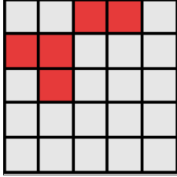
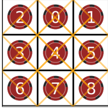
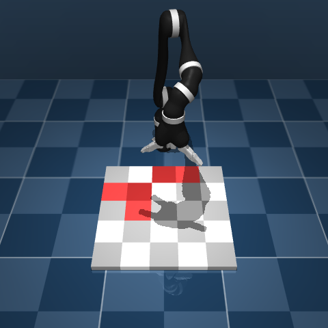
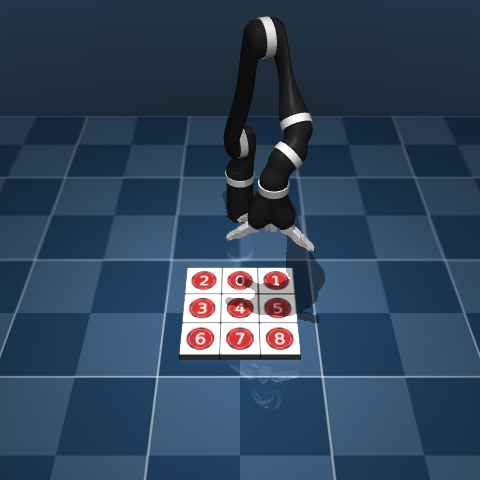
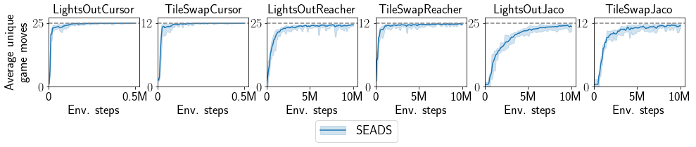
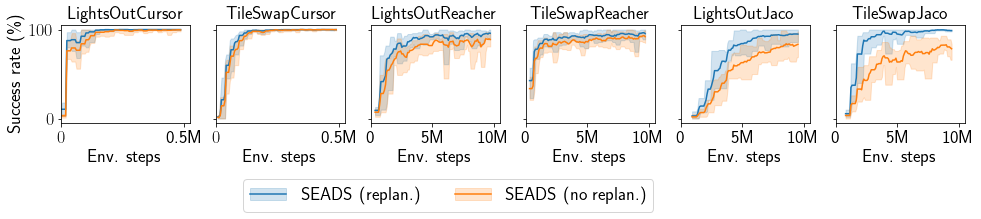

# Code for the SEADS agent

This repository contains code corresponding to the SEADS agent presented in:

Achterhold, Jan and Krimmel, Markus and Stueckler, Joerg: \
**Learning Temporally Extended Skills in Continuous Domains as Symbolic Actions for Planning**\
6th Annual Conference on Robot Learning 2022 (CoRL 2022)

Project page: https://seads.is.tue.mpg.de/ \
Full paper: https://openreview.net/forum?id=t-IO7wCaNgH

If you use the code, data or models provided in this repository for your research, please cite our paper as:
```
@inproceedings{
    achterhold2022learning,
    title={Learning Temporally Extended Skills in Continuous Domains as Symbolic Actions for Planning},
    author={Jan Achterhold and Markus Krimmel and Joerg Stueckler},
    booktitle={6th Annual Conference on Robot Learning (CoRL)},
    year={2022},
    url={https://openreview.net/forum?id=t-IO7wCaNgH}
}
```

## Physically embedded single-player board game environments
| | | | | | |
| --- | --- | --- | --- | --- | --- |
|  |  |  |  |  |  |  |
| `LightsOutCursorEnv` | `TileSwapCursorEnv` | `LightsOutReacherEnv` | `TileSwapReacherEnv` | `LightsOutJacoEnv` | `TileSwapJacoEnv` |

In our paper, we present physically embedded single-player board game environments, following the physically embedded
multi-player board games introduced by Mirza et al., 2020 [1]. **Please find the implementation of these environments in a different
repository at https://github.com/EmbodiedVision/seads-environments**.

## Train/evaluate SEADS

#### Preliminaries
1) Clone repository
    ```
    git clone https://github.com/EmbodiedVision/seads-agent
    ```
2) Setup virtual environment (Python 3.8, CUDA version: `11.1`, CuDNN version: `8.2.0`):
   ```
   python3.8 -m venv seads-venv
   source seads-venv/bin/activate
   pip install -U pip setuptools wheel
   pip install torch==1.9.0+cu111 torchvision==0.10.0+cu111 torchaudio==0.9.0 -f https://download.pytorch.org/whl/torch_stable.html
   pip install -r seads-agent/requirements.txt
   ```

3) Install environments from https://github.com/EmbodiedVision/seads-environments. After installation, change back to the directory in which you cloned this repository (i.e., `cd ..`).

4) Install sacred 0.83 manually (by 2022-01-10, only sacred 0.82 is available via `pip`)
   ```
   git clone https://github.com/IDSIA/sacred.git
   cd sacred/
   git checkout 0.8.3
   python setup.py install
   cd ../
   ```

5) Set environment variables for mujoco(-py)
   ```
    export LD_LIBRARY_PATH=$LD_LIBRARY_PATH:<MUJOCO_200_DIR>/bin/
    export MJKEY_PATH=<PATH_TO_MJKEY.TXT>
    export MJLIB_PATH=<MUJOCO_200_DIR>/bin/libmujoco200.so
    export MUJOCO_GL="osmesa"
   ```

6) Switch to the repository root directory
   ```
   cd seads-agent/
   ```

7) Please note that a single experiment requires ~1&nbsp;GB (LightsOutCursor) to 3.7&nbsp;GB (TileSwapJaco) of storage, resulting in a total storage requirement of 150&nbsp;GB to train 10 agents on each proposed environment.
As a storage location for the experiments, either
    * Create the experiment directory with `mkdir experiments`
    * or link the `experiments/` directory to your preferred storage location, e.g. `ln -s /bigstorage/experiments experiments`


8) Add the project directory to your `PYTHONPATH`. Assume you are currently in the root directory of this repository, run
   ```
   export PYTHONPATH=$PYTHONPATH:"`pwd`"
   ```

#### Train a single agent
Assume we want to train the SEADS agent on `LightsOutCursor`, we first need to initialize the experiment with
```
python -m seads.train_seads -p --force-id=corl22_lightsout_cursor_default_s1 with lightsout_cursor_env skill_forward_model seed=112234
```
The above call should finish with an `InitializationFinishedInterrupt`.
Then, we need to train the agent until training finishes with exit code `0` (you would probably
use your favourite job scheduling tool for this), as the call to `train_seads` only trains for a certain number of epochs
```
until python -m seads.train_seads restart_base=corl22_lightsout_cursor_default_s1; do sleep 1; done
```
For different environments, change `lightsout_cursor_env` to
{`lightsout_reacher_env`, `lightsout_jaco_env`, `lightsout_jaco_stairs_env`,
`tileswap_cursor_env`, `tileswap_reacher_env`, `tileswap_jaco_env`
}.

#### Run a single agent
After training, we can solve board games with the trained model, in this example, for a solution depth of 5:
```
python -m seads.solve_board --run_dir experiments/seads/corl22_lightsout_cursor_default_s1/ --ckpt last --envseed 42 --maxsoldepth 5 --render
```
The solution trajectory for this particular example is rendered into the directory `experiments/seads/corl22_lightsout_cursor_default_s1/eval_rollouts/ckpt=5000_seed=42_soldepth=5_replan=False_envnoise=none_heuristics=none`.
To enable replanning, add the `--replan` option.

#### Train agents on all environments
1) Generate all configurations by running
    ```
    python seads/jobs/experiments/corl22/job_gen_seads.py
    ```

2) Initialize the experiments: Run all commands in `job_list_init_*.txt`, e.g. with `parallel < seads/jobs/experiments/corl22/job_list_init_cursor.txt`.

3) Run the experiments by running the commands in `job_list_restart_*.txt`. The commands listed in these
files do **not** train the agent until the environment step limit is reached, but for a certain number of epochs.
You need to re-launch the commands in  `job_list_restart_*.txt` using your preferred job-scheduler or manually.
Experiments on the Reacher and Jaco environments make use of parallel experience collection, thus, it is beneficial to use multiple CPU cores (4).
We recommend 16 GB of RAM per training process for Reacher and Jaco and 8 GB for the Cursor environments.


#### Evaluate agents on all environments
* Skill coverage: To evaluate skill coverage,
    1) Run `python seads/jobs/evaluation/corl22/corl22_skillcoverage/generate_jobs.py`
    2) Execute all commands in `seads/jobs/evaluation/corl22/corl22_skillcoverage/job_list.txt`
    3) Run the notebook at `seads/jobs/evaluation/corl22/corl22_skillcoverage/skill_coverage_evaluation_default.ipynb`

    

* Task performance: To evaluate task performance,
    1) Run `python seads/jobs/evaluation/corl22/corl22_planning/generate_jobs.py`
    2) Execute all commands in `seads/jobs/evaluation/corl22/corl22_planning/job_list.txt`
    3) Run the notebook at `seads/jobs/evaluation/corl22/corl22_planning/evaluation_planning_default.ipynb`

    

## License
See [LICENSE.md](LICENSE.md).

For license information on 3rd-party software we use in this project, see below.


## Third-party software
This repository contains the following third-party software components:
* Soft actor-critic agent from https://github.com/pranz24/pytorch-soft-actor-critic
(MIT license), see [seads/modelfree/3RD_PARTY.md](seads/modelfree/3RD_PARTY.md).

* The file `seads/utils/sacred_utils/restartable_experiment.py` contains code from the
'sacred' experiment management repository at https://github.com/IDSIA/sacred,
licensed under the MIT License. A copy of the license is at
[seads/utils/sacred_utils/SACRED_LICENSE](seads/utils/sacred_utils/SACRED_LICENSE).
See the source file for case-by-case highlighting of the borrowed code excerpts.

## References
[1] M. Mirza, A. Jaegle, J. J. Hunt, A. Guez, S. Tunyasuvunakool, A. Muldal, T. Weber, P. Karkus,
S. Racanière, L. Buesing, T. P. Lillicrap, and N. Heess. “Physically Embedded Planning
Problems: New Challenges for Reinforcement Learning”. In: CoRR abs/2009.05524 (2020).
arXiv: 2009.05524. URL: https://arxiv.org/abs/2009.05524.
